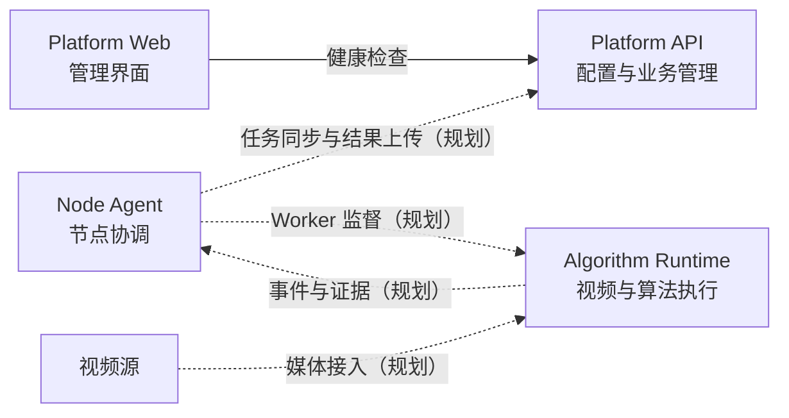

# StreamFusion AI

**面向实时视频分析的 AI 平台**

将平台管理、节点协调和算法执行分开，逐步构建从视频接入、任务运行到事件证据的完整链路。

[快速开始](#快速开始) · [系统架构](#系统架构) · [开发指南](DEVELOPMENT.md) · [公共协议](contracts/README.md) · [路线图](#路线图) · [反馈问题](https://github.com/flycodeu/StreamFusion-AI/issues)

> **项目状态：早期开发。** 当前提供工程骨架、健康检查、分环境配置、日志与自动化检查。视频拉流、模型推理、任务调度及事件管理尚未实现，暂不具备生产使用条件。

## 项目介绍

StreamFusion AI 的目标是让视频分析任务可以被统一配置、在算法节点上执行，并将结果转化为可查看、可追踪的事件与证据。

项目采用单仓库管理三个工程：Java 管理后端、Vue 管理前端和 Python 算法节点。算法节点内的 Agent 与 Runtime 使用独立环境和进程，便于后续分别演进。Java 平台不处理逐帧视频，视频与模型执行逻辑属于 Runtime。

## 当前能力

| 模块 | 当前已实现 | 尚未实现 |
|---|---|---|
| Platform API | 健康检查、四环境配置、启动校验、统一错误、OpenAPI JSON | 用户、相机、任务及事件 API |
| Platform Web | 后端连接检查、请求超时、错误码与请求标识、手动重试 | 管理页面、视频预览 |
| Node Agent | 独立环境与配置、健康接口、接口文档、请求日志 | 节点注册、心跳、任务同步、进程监督 |
| Algorithm Runtime | 独立环境与配置、健康接口、接口文档、请求日志 | 拉流、解码、模型推理、事件与证据 |
| 工程基础 | 依赖锁定、环境检查、日志轮转与脱敏、质量检查、CI 工作流、协议样例校验 | 自动部署、部署编排 |

健康接口返回 `UP` 仅表示进程可用；Python 接口中的 `mode=skeleton` 表示当前为空壳实现。
公共协议为设计基线，不代表节点同步链路已经运行；CI 结果以 [GitHub Actions](https://github.com/flycodeu/StreamFusion-AI/actions) 的实际记录为准。

## 系统架构

下图是组件职责与目标调用关系。**实线为当前已实现调用，虚线为计划接入链路。**



| 工程 | 技术栈 | 职责 |
|---|---|---|
| `platform-api` | Java 21 · Spring Boot 3.5 · Maven | 平台配置、业务状态与对外 API |
| `platform-web` | Vue 3 · TypeScript · Vite · Element Plus | 管理交互和运行状态展示 |
| `algorithm-node/node-agent` | Python 3.12 · FastAPI | 平台与算法节点之间的协调入口 |
| `algorithm-node/runtime` | Python 3.12 · FastAPI | 视频处理与算法执行入口 |

一个仓库不限制独立构建和部署。Agent 与 Runtime 不共享虚拟环境，不互相导入实现。

## 快速开始

以下步骤使用 **Windows PowerShell**。当前工程骨架不依赖 MySQL、Docker、相机或 GPU。

### 1. 准备环境

| 工具 | 版本要求 | 版本依据 |
|---|---|---|
| JDK | 21 | [pom.xml](platform-api/pom.xml)、[.java-version](platform-api/.java-version) |
| Maven | 3.9.11，由 Wrapper 下载 | [Wrapper 配置](platform-api/.mvn/wrapper/maven-wrapper.properties) |
| Node.js | 24.21.0 | [.nvmrc](platform-web/.nvmrc) |
| pnpm | 10.34.5 | [package.json](platform-web/package.json) |
| Python | 3.12 | [pyproject.toml](algorithm-node/node-agent/pyproject.toml) |
| uv | CI 固定使用 0.7.19 | Python 依赖安装与环境管理 |

设置 `JAVA_HOME` 为 JDK 21 的安装目录，并确认 `java -version`、`node -v`、`pnpm -v`、`uv --version`。
首次安装需能访问 Maven、npm 和 PyPI。无需安装全局 Maven。

### 2. 获取代码

```powershell
git clone https://github.com/flycodeu/StreamFusion-AI.git
cd StreamFusion-AI
```

### 3. 安装与构建

以下命令均从仓库根目录开始：

```powershell
# 后端：编译、测试、打包
Push-Location platform-api
.\mvnw.cmd clean verify
Pop-Location

# 前端：安装固定依赖、类型检查、构建
Push-Location platform-web
pnpm install --frozen-lockfile
pnpm build
Pop-Location

# Agent 与 Runtime：分别建立虚拟环境
Push-Location algorithm-node/node-agent
uv sync --locked
Pop-Location

Push-Location algorithm-node/runtime
uv sync --locked
Pop-Location
```

安装后可从根目录执行 `.\scripts\doctor.ps1`，检查工具链、Python 解释器、依赖与默认端口。
该脚本只诊断，不安装软件，也不停止占用端口的进程。

### 4. 启动服务

在仓库根目录打开四个终端，每个终端执行一条命令：

```powershell
.\scripts\start.ps1 api -Profile dev
.\scripts\start.ps1 web
.\scripts\start.ps1 agent
.\scripts\start.ps1 runtime
```

| 服务 | 本地入口 |
|---|---|
| Web | http://127.0.0.1:5173 |
| API 健康检查 | http://127.0.0.1:8080/actuator/health |
| API 接口描述（开发环境） | http://127.0.0.1:8080/v3/api-docs |
| Agent 健康检查 / 接口文档 | http://127.0.0.1:8100/health · http://127.0.0.1:8100/docs |
| Runtime 健康检查 / 接口文档 | http://127.0.0.1:8101/health · http://127.0.0.1:8101/docs |

打开 Web，应显示后端“运行正常”。运行以下命令检查默认端口：

```powershell
.\scripts\check-health.ps1
```

各终端使用 `Ctrl+C` 停止服务。

<details>
<summary>不使用启动脚本</summary>

在各工程目录启动：API 使用 `mvnw.cmd spring-boot:run`，Web 使用 `pnpm dev`。
Agent / Runtime 的独立命令见 [算法节点说明](algorithm-node/README.md)。

Linux / macOS 可使用 `sh mvnw` 替代 `mvnw.cmd`，其他工程使用相同的 pnpm / uv 命令。
当前启动验收基于 Windows；Linux 媒体与 GPU 运行链路尚未验证。

</details>

## 环境配置

### 后端

`application.yml` 仅保存公共项，默认使用 `dev`。每次选择一个环境，各环境配置互不导入。

| 环境 | 配置位置（相对于 platform-api） | 使用方式 |
|---|---|---|
| dev | `src/main/resources/application-dev.yml` | 共享开发默认值 |
| local | `src/main/resources/application-local.yml` 加载 `config/application-local.yml` | 私有配置保留在本地，不提交、不打包 |
| prod | `src/main/resources/application-prod.yml` | 公开默认值，部署参数由环境提供 |
| test | `src/test/resources/application-test.yml` | 测试显式激活，随机端口，不打包 |

使用本地配置时，从仓库根目录执行一次复制；已有配置时跳过复制：

```powershell
Copy-Item platform-api/config/application-local.yml.example platform-api/config/application-local.yml
# 修改复制后的文件，再启动
.\scripts\start.ps1 api -Profile local
```

`local` 配置缺失会报错。路径相对于 API 的运行目录解析，启动脚本会自动切换目录；也可通过 `LOCAL_CONFIG_PATH` 指定绝对路径。

运行打包后的应用，在 `platform-api` 目录执行：

```powershell
java -jar target/platform-api-0.1.0-SNAPSHOT.jar --spring.profiles.active=prod
```

| 环境变量 | 用途 |
|---|---|
| `SPRING_PROFILES_ACTIVE` | 选择环境，例如 `prod` |
| `SERVER_ADDRESS` | 监听地址，默认 `127.0.0.1` |
| `SERVER_PORT` | HTTP 端口，默认 `8080` |
| `LOCAL_CONFIG_PATH` | local 配置文件位置，仅 local 环境使用 |

`prod` 只是配置环境，不代表当前骨架已经具备认证、HTTPS 或生产部署能力。

### 前端与算法节点

前端需要改变后端地址时，复制 [环境变量示例](platform-web/.env.example) 为 `platform-web/.env.local`，
修改 `API_TARGET` 后重启 Vite。默认请求链为浏览器 → Vite 代理 → Platform API。

Agent 与 Runtime 在各自目录使用 `uv run --locked python -m app` 启动。
需要自定义时，将各自的 `.env.example` 复制为 `.env.local`，分别使用 `SF_AGENT_*` 和 `SF_RUNTIME_*` 配置；
环境变量优先于文件，配置错误会阻止正常启动。已有文件不要覆盖。
完整配置项、日志位置和超时边界见 [开发指南](DEVELOPMENT.md#配置入口)。

## 开发与验证

| 检查 | 工作目录 | 命令 |
|---|---|---|
| 后端格式、构建与测试 | `platform-api` | `mvnw.cmd clean verify` |
| 前端检查与测试 | `platform-web` | `pnpm lint`、`pnpm format:check`、`pnpm test`、`pnpm build` |
| Agent 配置与接口测试 | `algorithm-node/node-agent` | `uv run --locked python -m pytest -q` |
| Runtime 配置与接口测试 | `algorithm-node/runtime` | `uv run --locked python -m pytest -q` |
| 公共协议校验 | 仓库根目录 | `uv run --project algorithm-node/node-agent --locked python -m pytest contracts/tests -q` |
| 本地环境检查 | 仓库根目录 | `.\scripts\doctor.ps1` |
| 运行中的服务检查 | 仓库根目录 | `.\scripts\check-health.ps1` |

测试覆盖健康响应、配置加载与隔离、非法配置、错误分类、请求标识、日志脱敏及协议样例。
Python 的 Ruff、mypy 命令和格式化方法见 [开发指南](DEVELOPMENT.md#验证命令)。
GitHub Actions 配置了 Windows / Linux 检查矩阵，不包含部署操作。
这些检查不能替代完整浏览器链路、真实视频、推理精度或 GPU 性能验收。

<details>
<summary>常见启动问题</summary>

- **Java 版本错误**：检查 `JAVA_HOME` 是否指向 JDK 21；可向启动脚本传入 `-JavaHome`。
- **前端连接失败**：先访问 API 健康地址，再检查 `API_TARGET`，改动后重启 Vite。
- **端口占用**：检查 8080、5173、8100、8101 的监听进程。修改端口后同时调整代理和检查地址。
- **依赖下载失败**：检查网络、代理和包管理器镜像配置。
- **local 文件找不到**：检查启动工作目录及 `LOCAL_CONFIG_PATH`。
- **运行日志**：查看启动终端及各服务默认 `.run/logs/`，用响应中的 `X-Trace-Id` 定位请求；当前没有任务或事件日志。
- **发布前端**：`dist/` 需要静态服务器及 API 反向代理，不能把 Vite 开发服务器作为生产部署方案。

</details>

## 目录结构

```text
StreamFusion-AI/
├── .github/workflows/         # GitHub Actions 自动检查
├── platform-api/              # Java 平台后端
│   ├── config/                # 外部配置，仅示例提交
│   └── src/
│       ├── main/              # 应用代码与公共环境配置
│       └── test/              # 测试与 test 环境配置
├── platform-web/              # Vue 管理端
├── algorithm-node/
│   ├── node-agent/            # 节点协调进程与独立依赖
│   └── runtime/               # 算法执行进程与独立依赖
├── contracts/                 # 公共协议、样例及校验
├── scripts/                   # 启动、环境诊断与健康检查
└── DEVELOPMENT.md             # 配置、日志与开发约定
```

版本文件、依赖锁文件、Maven Wrapper 和无敏感信息的配置示例纳入版本管理。
依赖目录、构建产物、IDE 配置、真实 `.env`、本地配置和算法运行数据不提交。
`.github/` 是共享自动检查配置，应提交；本地工具目录 `.tools/` 和运行目录 `.run/` 不提交。

## 路线图

以下为开发方向，未勾选项尚未实现，不代表版本或交付时间承诺。

- [x] 三工程骨架，Agent / Runtime 独立运行
- [x] 健康检查、环境配置分离与依赖锁定
- [x] 启动校验、环境诊断、日志与错误处理基础
- [x] 代码质量检查、CI 工作流与公共协议样例
- [ ] 数据库迁移与基础存储接入
- [ ] 真实视频接入、解码与单路模型推理
- [ ] 节点注册、任务同步与 Runtime 监督
- [ ] 相机、场景、模型和任务管理
- [ ] 事件聚合、原图 / 标注图及录像证据
- [ ] 多节点运行、恢复机制与容量验证

## 参与贡献

欢迎通过 [Issues](https://github.com/flycodeu/StreamFusion-AI/issues) 反馈问题或讨论需求。
报告问题时，请提供运行环境、复现步骤、预期结果和脱敏后的日志。

提交 Pull Request 前，请先运行涉及工程的检查。涉及组件职责或公共协议的变更，建议先开 Issue 讨论。
请勿提交相机凭证、访问令牌、真实服务配置、模型制品或现场视频。

## 许可证

许可证尚未确定，仓库暂未附带 `LICENSE` 文件。确定后将在此处说明。
